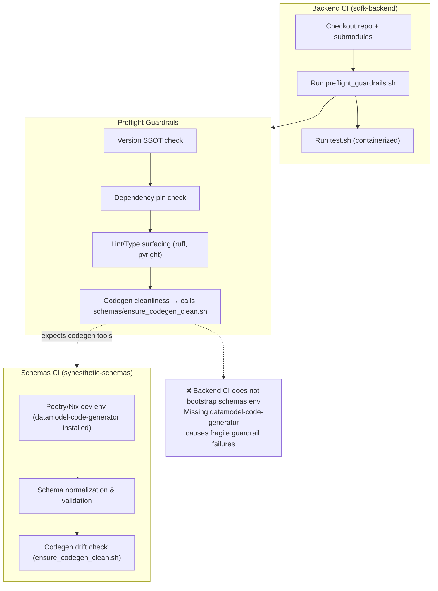
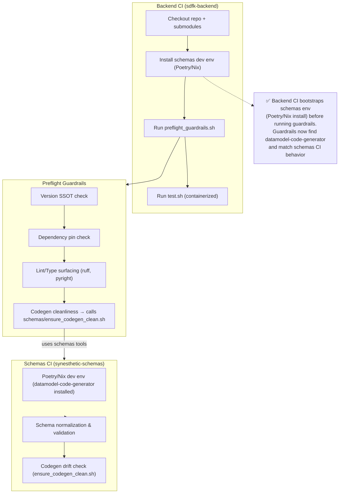

# Wednesday September 10, 2025

## Plan

- Add Backend CI Implementation Summary

    ### Backend CI Implementation Summary

    #### Test Harness (`test.sh`)

    *   **Purpose**: Canonical entrypoint for running tests in CI.
    *   **Mode**: Container-centric — spins up Docker services (Postgres, Redis, app containers).
    *   **Flow**:

        1.  Builds `sdfk-backend-web` and `sdfk-backend-trainer` images.
        2.  Configures runtime sysctls for Redis (e.g., `vm.overcommit_memory`, `somaxconn`).
        3.  Starts services via `docker-compose` (or equivalent).
        4.  Runs the test suite (`pytest`, integration tests, etc.) inside the containers.

    This approach makes `test.sh` self-contained: local dev and CI both use it, ensuring reproducibility.

    ---

    #### Preflight Guardrails (`scripts/preflight_guardrails.sh`)

    *   **Purpose**: Run checks before or alongside `test.sh`.

    *   **Checks Included**:

        *   **Version SSOT**: Frontmatter in README/docs matches `libs/synesthetic-schemas/version.json`.
        *   **Dependency Pin Consistency**: Aligns root Poetry vs. schemas/python/pyproject.toml.
        *   **Lint & Type Surfacing**: Runs `ruff` and `pyright` (non-blocking locally, strict in CI).
        *   **No blanket `# noqa` / `# type: ignore`**.
        *   **Deprecation Guard**: Flags `jsonschema.RefResolver`.
        *   **Codegen Cleanliness**: Calls `libs/synesthetic-schemas/scripts/ensure_codegen_clean.sh`.
        *   **Legacy Example Audit**: Flags old “auto-converted” bundle notes.

    *   **Execution Modes**:

        *   **Local dev**: Non-blocking, surfaces warnings.
        *   **CI**: Enforced strict (`STRICT_GUARDRAILS=1 STRICT_CODEGEN=1`).

    ---

    #### Current CI Workflows

    *   **`.github/workflows/preflight-guardrails.yml`**:

        *   Runs on PRs and pushes to `main`.
        *   Steps:

            1.  Check out repo (with submodules).
            2.  Install Python runtime deps (`requirements.txt`).
            3.  Install dev tooling (pinned `ruff`, `pyright`).
            4.  Set up Node 20 for schema codegen drift check.
            5.  Run `scripts/preflight_guardrails.sh` in strict mode.

    *   **Main test CI** (not fully expanded here, but implied by `test.sh`):

        *   Builds containers, runs integration/unit tests inside them.
        *   Uses Docker services (Postgres/Redis) instead of local Poetry/Nix installs.
        *   Enforces green test suite before merge.

    ---

    #### The Disconnect

    *   **Schemas Repo Expectation**:
        Codegen requires `datamodel-code-generator`, declared in the **schemas root Poetry config**.
    *   **Backend CI Reality**:
        Backend doesn’t bootstrap schemas’ Poetry environment. When `preflight_guardrails.sh` calls into schemas’ `ensure_codegen_clean.sh`, the Python toolchain is missing → error.
    *   **Why It’s Fragile**:
        Backend CI assumes schemas repo is just static files, but in reality it has its own dev-tooling contract.

    ---

    #### Key Takeaway

    Backend CI has two layers:

    1.  **Containerized `test.sh`** → isolated, reproducible app/runtime testing.
    2.  **Host-level `preflight_guardrails.sh`** → schema/codegen/lint/version checks.

    They don’t share the same environment assumptions. The fragility is in the host-level guardrails: they invoke schemas tooling without respecting the schemas repo’s dev environment.

- begin feature flow for compute shader integration into the synesthetic asset
    - iterate canon audit prompt
    - generate gap report

## Backend CI ↔ Schemas CI Integration

### Current State (Broken)

### Target State (Fixed)

## Meetings

## Log

## Thoughts
- Teaching a cat to fetch
    - Trying to wrangle ai into some sort of tool to project vision feels a bit like that time I tried to teach a cat to fetch
        - Throw the ball. Watch the cat look at it. Cat looks at me. I get the ball.
        - Repeat

# Review
    - Highlights:e2e running and serving assets with schema ssot.
    - Roadblocks: - backend ci fragile

    - Next steps: Triage backend CI

**PROMPTS**
